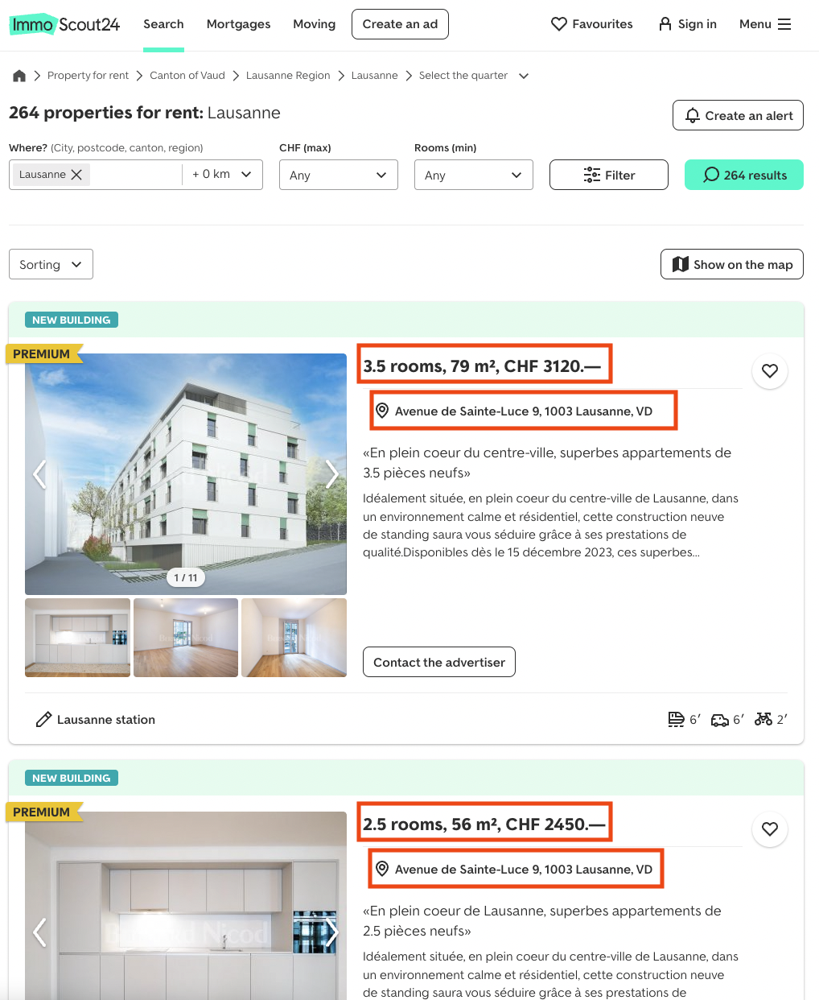
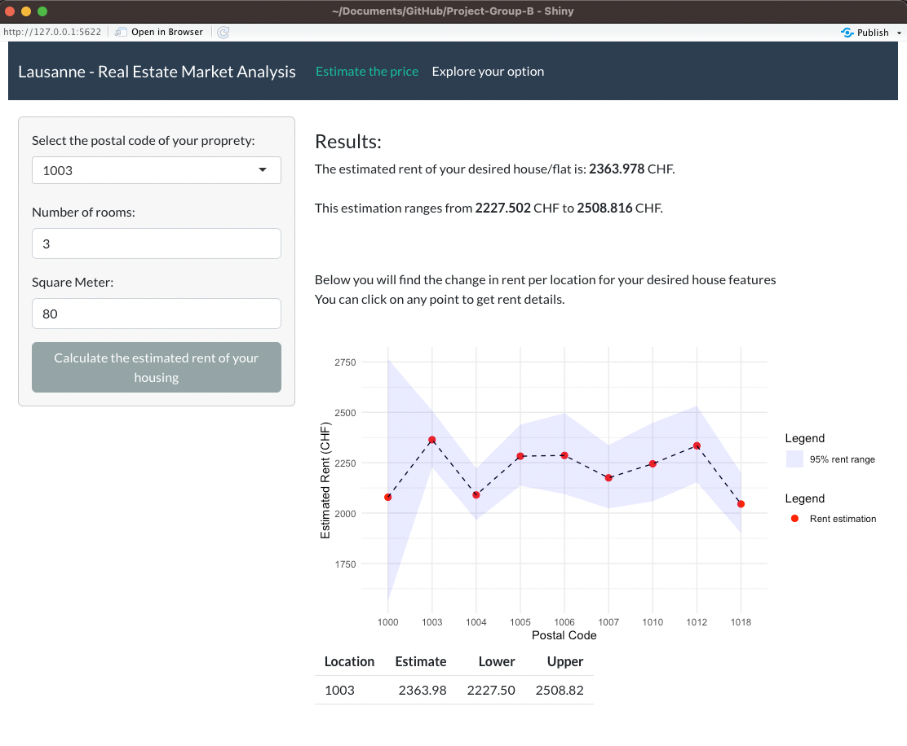
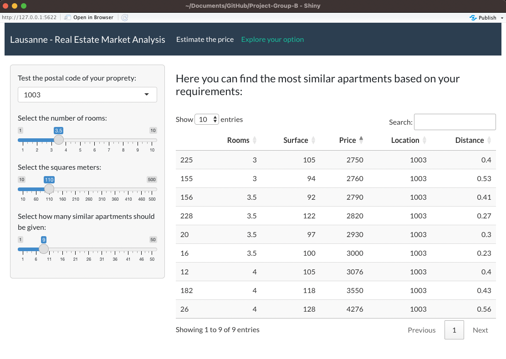

```{css, echo = FALSE}
.remark-slide-content {
  font-size: 28px;
  padding: 20px 80px 20px 80px;
}
.remark-code, .remark-inline-code {
  background: #f0f0f0;
}
.remark-code {
  font-size: 24px;
}
.huge .remark-code { /*Change made here*/
  font-size: 200% !important;
}
.tiny .remark-code { /*Change made here*/
  font-size: 50% !important;
}
```

```{r setup, include = FALSE}
knitr::opts_chunk$set(echo = FALSE)
```

```{r, echo=FALSE, warning=FALSE, message=FALSE}
library(tidyverse)
library(tidytext)
library(quanteda)
library(quanteda.textmodels)
library(quanteda.textstats)
library(quanteda.textplots)
library(textdata)
```


# Introduction and Objectives

## Objectives

- Use of Rmarkdown
- Use of GitHub as a collaborative tool to work on a R project
- Web scrapping using rvest
- Exploratory Data Analysis and functions creation
- Build a Shiny app to share results in an interactive way
- Construction of a R-package

## Project description  

Building a tool to help students and others to have an easy and fast access to an overview of rent prices in Lausanne depending to their need of number of rooms and location.

* Steps : webscrapping, functions creation for EDA, create a shiny app, create a R-package
* Source of data: Immoscout.ch

# Webscrapping  

## Immoscout website

```{r, out.width = "500px"}

```

# R Package creation   

## Package functions 

- estimate_price: A multiple linear regression function trained on the offers on Immoscout website that take a *number of rooms*, the *surface* and a *postal code* as variables and return an estimated rent price 
- Nearest_neighbors function: Return similar properties in terms of rooms, square meters, and location, helping in property comparison and recommendation
- launch_shiny_app: A function to facilitate the launch of the shiny app by specifying the path to the Shiny app directory within the **immoswiss** package

# Shiny App

## Price estimation 

```{r, out.width = "600px"}

```

## Find the 5 most similar appartments 

```{r, out.width = "800px"}

```

# Shiny App live demo

## Conclusion

We have successfully built a R package and a shiny app to display rent estimates and similar offers in Lausanne according to user input, thanks to web scrapping, creating functions to analyse the data and GitHub to work in a group on this project.

**Possible improvements: **

- Adding other cities -> could also improve the model estimates
- Adding new website sources to get more data
- Adding a direct link to the rent offer

