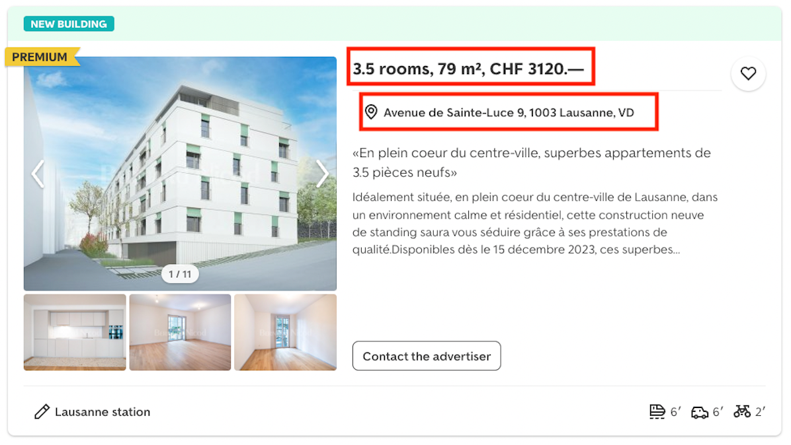

# Introduction and Objectives

## Project description and objectives 

* Create an intuitive and efficient interface for Lausanne residents, enabling them to easily find properties for rent by using data from a prominent real estate website `immoscout`. 

* *Step 1* : R Package Creation (immoswiss) - R package named 'immoswiss.' designed to estimate property rents in Lausanne based on specified features and to identify the most similar properties available in the market. 

* *Step 2*: Shiny App Creation - serving as an interactive interface for users interested in exploring the Lausanne real estate market. Users can input specific features and preferences to estimate property rents and discover the most similar properties available. 

# Webscrapping  

## Immoscout website

{width="100%"}

## Lausanne dataset  

{width="50%"}

Final dataset with 230 instances, each one representing an advertisement of a property  available in Lausanne. 
4 variables collected among all website pages : 

* **rooms** : Number of rooms in the property
* **meter_square** : Number of square meters in the property
* **price** : monthly rent of the property 
* **location** : zipcode of the property location 

# R Package creation : main functions  

## Multiple Linear Regresion

{width="100%"}

* \(\beta_0\) is the intercept,
* \(\beta_1\) is the coefficient for \(\text{rooms}\),
* \(\beta_2\) is the coefficient for \(\text{meter\_square}\),
* \(\beta_3\) is the coefficient for \(\text{location}\),
* \(\beta_4\) is the coefficient for \(\text{meter\_square} \times \text{location}\),
* \(\beta_5\) is the coefficient for \(\text{rooms} \times \text{location}\),
* \(\epsilon\) represents the error term.

## Shiny app interface - Price estimation 

{width="50%"} 

* *Estimated rent* : Multiple regression model estimates the rent prices for the specified zipcode, number of rooms, and square meters
* *Confidence interval*: 95% probability that the estimated rent price is between a lower bound and an upper bound.
* *Estimated rent depending on the location zipcode plot * :  Rent price variation of a specified property features in different locations in Lausanne and 95% confidence interval for every zipcode rent price estimation 

##  Shiny app interface - Find the k most similar properties

{width="60%"}

1. Insert the property features the user is looking for 
2. Compute the features distance between the features inserted and the properties in `lausanne dataset`.
3. Select the k nearest neighbors.
4. Table representing the k most similar properties in Lausanne.

# Conclusion  

## Limitations 

* Limited data due to webscraping 
* Non- ethical way of collecting data 
* Frequently updated website - dataset used in our package might change 

## Further improvements 

* Shiny app that could benefit future incoming students in Lausanne.
* Adding more data sources (real estate agencies, student accommodation entities, social media groups).
* Analysis part : redirection to url corresponding to the property. 

